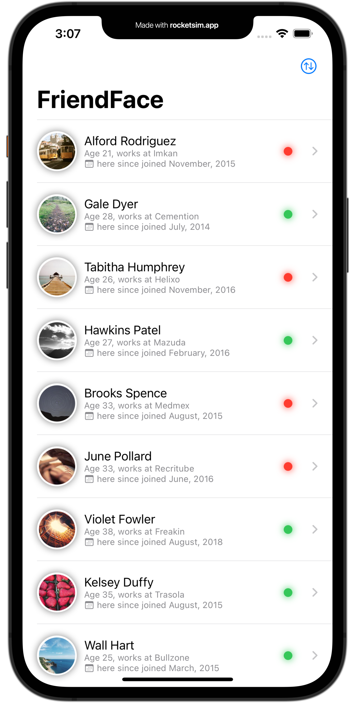
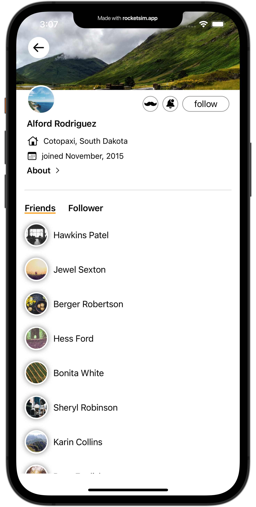
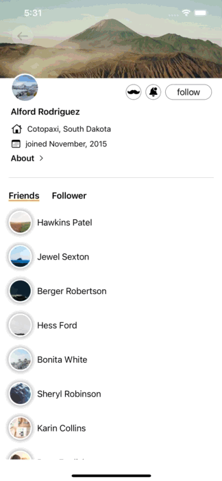

# FriendFace
This is my take on the HackingWithSwift Challenge Day 60.

Basically download JSON-Data, decode it and display it. As you can see, I've tried to copy the Twitter design a bit.

## Screenshots

  
  
  

## Requirements
* Xcode 13.0+ & Swift 5.5+
* iOS 15.0+

## License
The project is licenced under [GNU General Public License version 2](./LICENSE).
